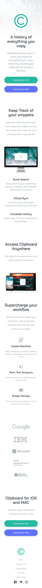
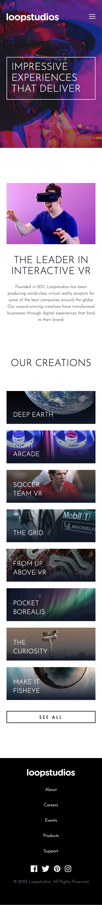

# Frontend
This repository showcases web design and code projects built using TailwindCSS, GSAP, and Scroll Magic. Browse the source code for inspiration or learn from these modern front-end development tools.

# Tailwind Projects

### Project Clipboard
[Frontend Master Challenge](https://www.frontendmentor.io/challenges/clipboard-landing-page-5cc9bccd6c4c91111378ecb9)

#### Desktop View

<b>Click here to check preivew</b>

#### Mobile View

<b>Click here to check preivew</b>

### Project LoopStudios
[Frontend Master Challenge](https://www.frontendmentor.io/challenges/loopstudios-landing-page-N88J5Onjw)

#### Desktop View

<b>Click here to check preivew</b>

#### Mobile View

<b>Click here to check preivew</b>

 

## p1 - preview

<b>Click here to check preivew</b>

## p2 - preview

<b>Click here to check preivew</b>

